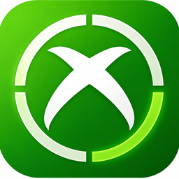

  
  <h1>X360 Manager</h1>
  
<strong>The Ultimate Premium Frontend for Xbox 360 Emulation</strong>

  
  
  

---

## 🌟 Overview

**X360 Manager** is a state-of-the-art, high-performance game management solution designed specifically for the Xbox 360 emulation community. It bridges the gap between raw emulation and a console-like experience, offering a beautiful glassmorphism-inspired UI, automated library management, and native support for **XBLA (Xbox Live Arcade)** and digital media.

## 🚀 What's New in v1.5.0?

Version 1.5.0 is our biggest update yet, focusing on **customization**, **integration**, and a **premium visual overhaul**.

### 🛠️ Professional Game Patching System
Take your games beyond their original limits. Our new Patching Engine allows you to:
- **Automatic Matching**: The app detects your game's **Title ID** and matches it with the correct community patches.
- **Configurable Modals**: Toggle 60FPS patches, resolution increases, and wide-screen fixes with a simple checkbox.
- **Community Driven**: Easily download and update the latest `.patch.toml` files from the community directly within the app.

### 🖼️ Elite Metadata & Cover Scraping
We’ve moved beyond basic web searches. 
- **ScreenScraper.fr API**: Direct integration for authentic, high-resolution 2D and 3D Xbox 360 box art.
- **Smart Data**: Automatically pulls game info, release dates, and developer details.
- **SteamDB Fallback**: High-reliability fallback system ensures your library always looks complete.

### �️ Native XBLA & Digital Support
No more manual renaming or path fixes. X360 Manager natively handles:
- **XBLA Titles**: Full support for digital-only Arcade games and indie titles.
- **Smarter Discovery**: Automatically scans and identifies extensionless XBLA/GOD packages using STFS header verification.
- **Deep Scraping**: Elite metadata fetching specifically tuned for digital-only titles.

### �🔗 Seamless OS Integration
Make your emulation library part of your Windows ecosystem:
- **Add to Steam**: Export any game as a non-Steam game with one click, enabling full **Steam Deck** and **Big Picture Mode** support.
- **Desktop Shortcuts**: Create custom shortcuts with game-specific icons directly to your desktop.
- **Native Installer**: A new compressed NSIS installer that handles file associations (`.iso`, `.xcp`, `.xex`) and Start Menu entries.

---

## 🎨 Key Features

- **💎 Premium UI/UX**: A modern dashboard featuring vibrant neon accents, glassmorphism, and smooth micro-animations.
- **📊 Real-Time Stats**: Track your total play time, game count, and emulator status at a glance.
- **⚡ Pro Launching**: Launch directly into Xenia or Xenia Canary with custom configurations per game.
- **🔎 Instant Search**: Ultra-fast filtering by Title ID, genre, or favorite status.
- **📦 Smart Packaging**: Designed to work as a lightweight portable app or a fully installed system tool.

---

## 🛠️ Installation & Setup

1. **Download**: Grab the latest `X360-Manager-Setup-1.5.0.exe` from the [Releases](https://github.com/Supermedo/x360-manager/releases) page.
2. **Setup**: Run the installer. It will create a desktop shortcut and add the app to your Start Menu.
3. **Configure**:
    - Open **Settings**.
    - Set your **Xenia/Xenia Canary path**.
    - Select your **Games Directory**.
4. **Play**: Your library will auto-populate. Click a game and hit **Play**!

---

## 📝 Changelog (v1.5.0 "Emerald")
- **NEW**: Native support for **XBLA**, **GOD**, and digital Arcade packages.
- **NEW**: Completely new application branding and high-res icon.
- **NEW**: Game Patches management system (Title ID based).
- **NEW**: "Add to Steam" integration for library unified management.
- **NEW**: "Create Desktop Shortcut" for individual games.
- **IMPROVED**: ScreenScraper.fr API integration for superior cover art.
- **IMPROVED**: Compressed Setup Installer (50% smaller download size).
- **FIX**: UI scaling issues on high-DPI (4K) monitors.
- **UX**: Version tagging in Sidebar and Help menus.

---

## 🤝 Credits
**Lead Developer:** [Mohammed Albarghouthi](https://github.com/MohammedAlbarghouthi)  
**Branding & UI:** X360 Team  

---

  
If you like this project, please give it a ⭐️!

